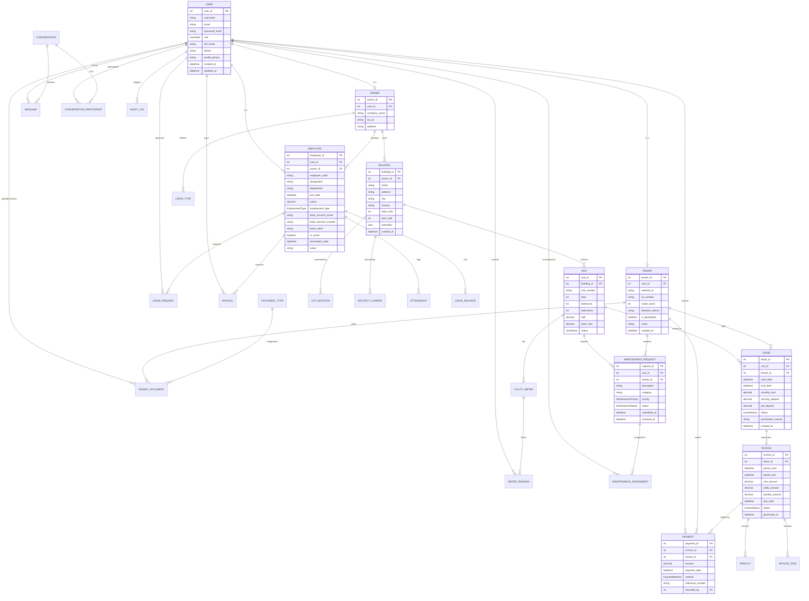

# Building Management System (BMS) ER Diagram

This document provides a visual representation and detailed explanation of the database schema for the Building Management System.

## ER Diagram (Mermaid)

## Detailed Schema Explanation

### 1. User Identity and Roles
The schema follows a **Class Table Inheritance** (or similar) pattern for users.

*   **`User` Model**: The central hub for authentication and profile information.
    *   **Multiplicity**: 
        *   `User` to `Tenant`: 1:0..1 (A user can be a tenant).
        *   `User` to `Owner`: 1:0..1 (A user can be an owner/landlord).
        *   `User` to `Employee`: 1:0..1 (A user can be an employee).
    *   **Roles**: Managed via the `UserRole` enum (`super_admin`, `owner`, `manager`, `tenant`, `staff`, `vendor`).

### 2. Property Management Hierarchy
The core of the BMS revolves around buildings and their components.

*   **`Owner` & `Building`**: An `Owner` can own multiple `Buildings` (1:N).
*   **`Building` & `Unit`**: A `Building` contains multiple `Units` (1:N).
*   **`Unit` & `Lease`**: A `Unit` can have multiple `Leases` over time, but typically only one `active` lease at a point (1:N).
*   **`Lease` & `Tenant`**: A `Lease` connects a `Tenant` to a `Unit` (N:1).

### 3. Financials (Invoicing & Payments)
*   **`Lease` & `Invoice`**: A `Lease` triggers recurring `Invoices` (1:N).
*   **`Invoice` & `InvoiceItem`**: An `Invoice` can have multiple line items like rent, utilities, and penalties (1:N).
*   **`Invoice` & `Payment`**: An `Invoice` can be settled by one or more `Payments` (1:N). If `invoice_id` is null, it's a general payment by a tenant.
*   **`Invoice` & `Penalty`**: Late payments trigger `Penalties` linked to the `Invoice` (1:N).

### 4. Human Resources & Payroll
*   **`Owner` & `Employee`**: An `Owner` (landlord/company) employs multiple `Employees` (1:N).
*   **`Employee` & `Payroll`**: Each `Employee` receives monthly/periodic `Payroll` records (1:N).
*   **`Employee` & `Attendance`**: Daily logs for work hours (1:N).
*   **`Employee` & `LeaveManagement`**: 
    *   `LeaveType`: Defined by the owner (e.g., Sick, Annual).
    *   `LeaveRequest`: Submitted by employees (1:N).
    *   `LeaveBalance`: Tracks remaining days per type per year.

### 5. Maintenance & Operations
*   **`MaintenanceRequest`**: Submitted by a `Tenant` for a specific `Unit`.
*   **`MaintenanceAssignment`**: Links a request to a `User` (usually staff/vendor) responsible for fixing it.
*   **Utility Tracking**: 
    *   `UtilityMeter`: Linked to a `Unit`.
    *   `MeterReading`: Periodic readings recorded by a `User` (staff).

### 6. Communication & Documentation
*   **Messaging**: 
    *   `Conversation`: A group of participants.
    *   `ConversationParticipant`: Junction table between `User` and `Conversation` (M:N).
    *   `Message`: Individual messages within a conversation sent by a `User`.
*   **Documents**:
    *   `TenantDocument`: Stores binary content (`file_content`) for IDs, leases, etc.
    *   `DocumentType`: Categories for documents.
    *   Relationship: Linked to `Tenant` (owner) and `User` (uploader/reviewer).

### 7. IoT & Monitoring
*   **`LiftMonitor`**: Real-time status tracking for elevators in a `Building`.
*   **`SecurityCamera`**: Stream URLs and locations for cameras in a `Building`.

### 8. System Integrity
*   **`AuditLog`**: Tracks all sensitive changes (`action`, `changes` as JSON) performed by any `User`.
